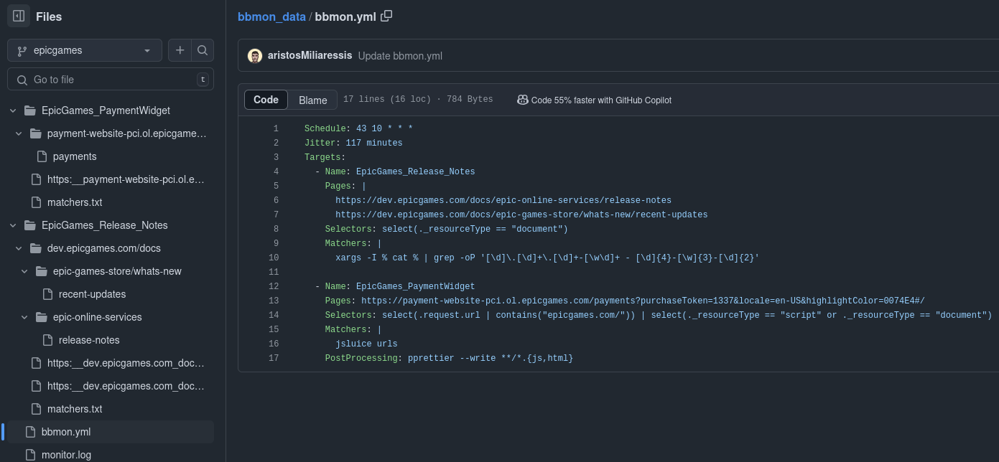

bbmon
==

web app monitoring automation

**Example Configuration**
```yaml
Schedule: 43 10 * * *
Jitter: 117 minutes
Targets:
  - Name: Skroutz
    Pages: |
      https://www.skroutz.gr/
      https://www.skroutz.gr/sign_in
      https://www.skroutz.gr/plus
      https://www.skroutz.gr/shop
    Selectors: select(._resourceType == "script")
    Matchers: |
      xargs -I % cat % | grep -oP '\.(get|post|patch|put)\([^\)]{2,}\)'

  - Name: EpicGames_Release_Notes
    Pages: |
      https://dev.epicgames.com/docs/epic-online-services/release-notes
      https://dev.epicgames.com/docs/epic-games-store/whats-new/recent-updates
    Selectors: select(._resourceType == "document")
    Matchers: |
      xargs -I % cat % | grep -oP '[\d]\.[\d]+\.[\d]+-[\w\d]+ - [\d]{4}-[\w]{3}-[\d]{2}'
    ExtraHeaders: |
      X-ApiKey: xyz

  - Name: EpicGames_PaymentWidget
    Pages:
      https://payment-website-pci.ol.epicgames.com/payments?purchaseToken=6cd0517934a94b86a416e9fccc8af97d&locale=en-US&highlightColor=0074E4#/
    Selectors: select(.request.url | contains("epicgames.com/")) | select(._resourceType == "script")
    Matchers: |
      xargs -I % cat %
    PostProcessing: pprettier --write **/*.js
  
  - Name: Example
    Custom: |
      <html>
      <script src='https://www.example.com/Scripts/videoScript.js'></script>
      <script src='https://www.example.com/Areas/Modals/Scripts/Modal.js'></script>
      <script src='https://www.example.com/bundles/standard-libs-scripts'></script>
      <script src='https://www.example.com/bundles/scripts'></script>
      </html>
    Matchers: |
      jsluice urls
    PostProcessing: pprettier --write **/*.js
    
  - Name: Example_openapi_spec
    Custom: |
      <html>
      <script src='https://api.example.com/v1/openapi.json'></script>
      </html>
    Matchers: |
      xargs -I % cat % | jq -r '.paths | keys[]'
  
  - Name: Example_GraphQL_Schema
    Custom: |
      <html>
      <script>
        fetch('https://api.example.com/graphql',{body:'query { __schema { types { name } } }'})
      </script>
      </html>
    Matchers: |
      xargs -I % cat %
```

if a github token is configured in [mnt/gh_hosts.yml](mnt/gh_hosts.yml) when the container starts it will look for a repository named `bbmon_data` under the current user and create it if it doesn't exist, after that a cronjob will be created that will run every midnight and clone each branch of that repository to the directory `/mnt/data/<branch>/` and update the monitoring cronjobs according to the schedule field in the `bbmon.yml` config file.

the `Jitter` field at the top of the `bbmon.yml` adds a random sleep after the cronjob is triggered and before the actual monitoring starts.

when a monitoring job starts all targets configured in the `bbmon.yml` config are monitored sequentially.

the `Pages` targets contain a list of urls that are navigated to directly using chrome and a HAR file is dumped in the repository for each url, then the responses are extracted and filterd using a list of `jq` select statements (`Selectors` field in `bbmon.yml`) that are OR'd together.

The `Custom` config contains an html page that gets dumped to a temporary file and navigated to using chrome with the `file://` scheme, all generated trafic is extracted.

after extracting responses from the HAR file the filenames of each extracted response are passed to the standard input of the commands in the `Matchers` field and the output of the command is passed to md5sum and compared against the output of the last execution, if they differ a notification is sent using notify and a commit is made and pushed to the appropriate branch of the bbmon_data repository.

chrome is controlled using puppeteer with the extra stealth plugin and passed the `--disable-web-security` argument that disables CORS.




